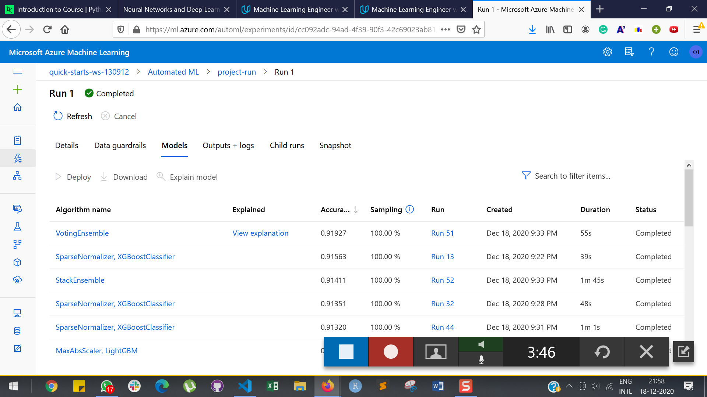
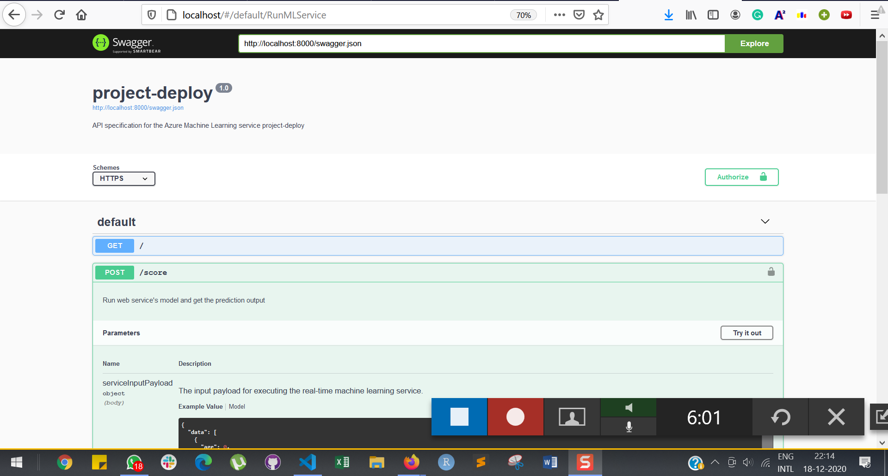
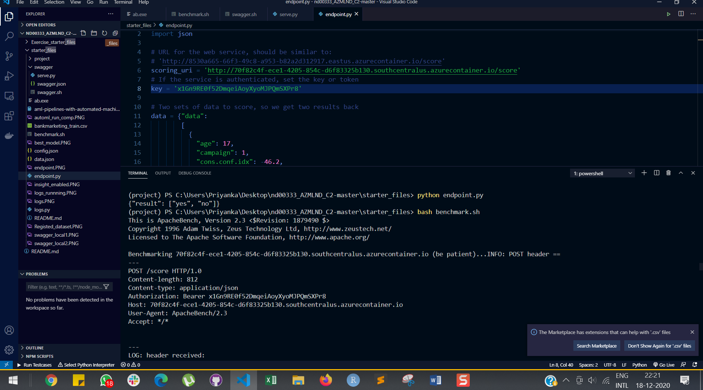
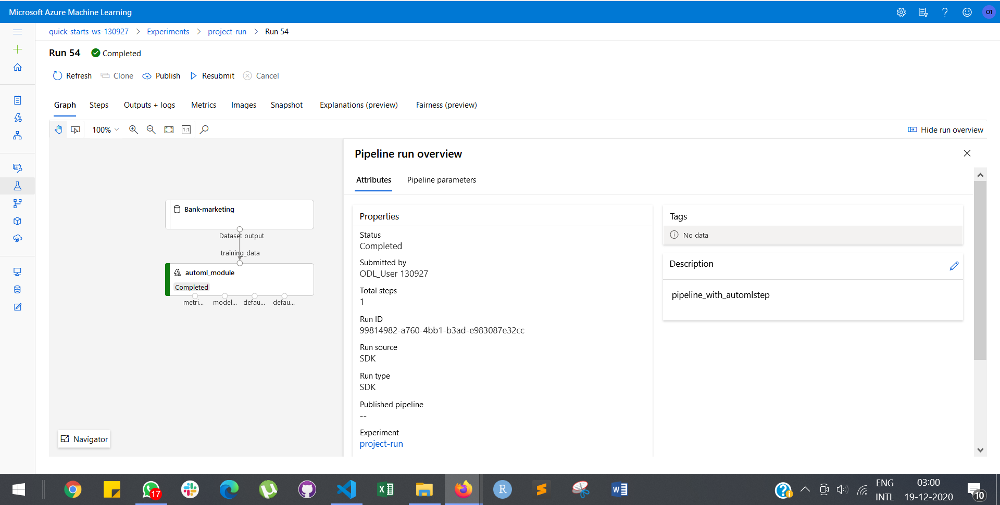

# Operationalizing Machine Learning

In this project, I have used Azure to configure a cloud-based machine learning production model, deployed, and consumed it. Also created, published, and consumed a pipeline. All this done using Bank Marketing dataset, on which classification algorithm is applied.

## Architectural Diagram

Main steps of project include :

 -  Authentication : Enabled Authentication for security

 -  Automated ML Experiment : Used Automated ML to determine the best model

 -  Deploy the best model : Best Model deployment in azure

 -  Enable logging : Download config.json and checked logs of deployed model 

 -  Swagger Documentation : Azure provides a Swagger JSON file for deployed models.Swagger is a tool that helps build, document, 
                            and consume RESTful web services and explains what types of HTTP requests that an API can consume,
                            like POST and GET.

 -  Consume model endpoints : Deployed service can be consumed via an HTTP API. An HTTP API is a URL that is exposed over the
                              network so that interaction with a trained model can happen via HTTP requests.

 -  Create and publish a pipeline :A great way to automate workflows is via Pipelines. Published pipelines allow external services
                                   to interact with them so that they can do work more efficiently.

                                       
 

## Key Steps

1) Authentication :
 Note: I have used udacity lab for my work therefore skip this task.
 In this step, I need to install the Azure Machine Learning Extension which allows you to interact with Azure Machine Learning Studio, part of the az command. After having the Azure machine Learning Extension, I will create a Service Principal account and associate it with my specific workspace.

2) Automated ML Experiment :
  At this point, security is enabled and authentication is completed. In this step, I have created an experiment using Automated ML, configure a compute cluster, and use that cluster to run the experiment.

  
  
  

3) Deploy the best model: 
  Deploying the Best Model will allow to interact with the HTTP API service and interact with the model by sending data over POST requests.

4) Enable Logging :
  Now that the Best Model is deployed, enable Application Insights and retrieve logs.
   
  
  

5) Swagger Documentation:
  Azure provides a Swagger JSON file for deployed models.Swagger is a tool that helps build, document, and consume RESTful web services and explains what types of HTTP requests that an API can consume,like POST and GET.
  
  

6) Consume model endpoints:
   
   -Once the model is deployed, use the endpoint.py script provided to interact with the trained model. In this step, run the script, modifying both the scoring_uri and the key to match the key for the service and the URI that was generated after deployment.

   

   -Benchmark the endpoint using Apache bench.

   
   

7) Create and publish a pipeline:
    For this part of the project, I have used the Jupyter Notebook provided in the starter files.
    
    
    
    
    
    
    

## Screen Recording
   Drive link: https://drive.google.com/file/d/11vf8KzBjM4Qsf8ZbuNiSfuQlCHpwfkL_/view?usp=sharing

## Standout Suggestions
 -fixing the imbalance in the data
 -Increase the number of datapoints
